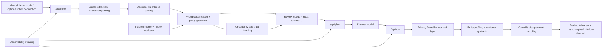

# Aegis Desk

Aegis Desk is an inbox intelligence system for the part of email that is hardest to handle well: messages that look important, relevant, or urgent, but are not immediately trustworthy or easy to prioritize.

I built it from a real moment during my job search. I found a role-related email in spam that looked legitimate enough to worry me. The sender looked real. The company looked real. The role looked relevant. But the spam placement changed the decision. The problem was no longer "what does this email say?" It was "what should I do with it, and how much should I trust it?"

That is the problem Aegis Desk is built around.

**Aegis Desk turns inbox uncertainty into prioritized, verified action.**

Live application: https://aegis-desk-kappa.vercel.app/  
Demo video: _Add Loom or walkthrough link here_

## Problem Statement

Inbox overload is usually described as a volume problem. In practice, it is often a trust and prioritization problem.

The hardest messages are not obvious spam. They are the ones that sit in the middle:

- recruiter outreach from an unfamiliar sender
- contract or legal follow-ups without enough context
- vendor or payment requests with pressure to act quickly
- operational email that seems relevant but still feels off
- promotional mail that competes with genuinely time-sensitive communication

Most inbox tools help organize mail after it arrives. They do not do enough for the moment when a user has to decide whether a message deserves attention, skepticism, escalation, or a response.

That gap became obvious to me during job applications, but it is not limited to job search. The same uncertainty shows up in operations, recruiting, finance, vendor management, and external communications more broadly.

The workflow problem Aegis Desk focuses on is:

1. deciding which messages deserve deeper attention
2. deciding whether the sender or entity is trustworthy enough to act on
3. deciding when outside research is required before responding
4. preserving a reasoning trail so the recommendation can be inspected later

### Who this helps

Aegis Desk is built for people whose inbox contains real decisions, not just routine correspondence:

- job seekers triaging recruiter or hiring-related email
- operators and founders sorting legal, vendor, and payment-related communication
- consultants and freelancers handling unfamiliar inbound requests
- support or operations teams reviewing ambiguous external outreach
- anyone dealing with a mix of routine noise and potentially important but unverified messages

The common thread is not industry. It is uncertainty.

### What success looks like

Success here is not perfect classification. It is better decisions at the point of uncertainty.

In practice, that means:

- important messages are less likely to be buried under noise
- suspicious messages are treated as verification problems, not automatically trusted or discarded
- the user gets a recommendation with evidence, not just a label
- follow-up drafting happens after trust evaluation, not before
- ambiguous cases are pushed toward review instead of false certainty

If I were measuring this in a production setting, I would care about:

- fewer false high-priority promotions or newsletters
- better recovery of legitimate messages that would otherwise be ignored
- better calibration between confidence and actual uncertainty
- stronger follow-through quality after a recommendation is made

## Solution Overview

Aegis Desk is a trust-first inbox workflow system. It is designed less like a chatbot and more like a working desk for triage, verification, and action.

The current product flow is organized around a simple sequence:

1. scan and normalize inbound email
2. score what deserves attention now versus later
3. classify likely mail type and risk
4. decide whether the thread needs deeper review
5. research and profile relevant people, companies, or entities
6. synthesize an evidence-backed recommendation
7. draft a response or create follow-through artifacts

### Product surfaces in the current build

- **Inbox Scanner**  
  The inbox intake surface. It supports manual input and optional Gmail-connected scans, then returns priority, class, uncertainty, and recommended action.
- **Review Queue**  
  The triage layer. Instead of forcing the user to read their inbox linearly, it surfaces what the system believes deserves attention first.
- **Agent Desk**  
  The deeper analysis workspace. This is where Aegis plans next steps, gathers evidence, profiles entities, and produces a final structured output.
- **Tickets / Follow-through layer**  
  A place to turn uncertain messages into owned work once they need a response, escalation, or tracking.

### What Aegis Desk does differently

Aegis Desk does not stop at labeling email. It tries to support the decision around the email.

That means it is built to:

- separate importance from mere urgency language
- separate suspicion from certainty of harm
- research sender and entity context before drafting a response
- preserve uncertainty when the system does not have enough evidence
- make the reasoning trail visible instead of hiding it behind a confident answer

This is why I do not frame it as a generic spam filter, a phishing-only tool, or a simple summarizer. The value is in the workflow: triage, verification, analysis, and action in one path.

## AI Integration

AI is not decorative in Aegis Desk. The system depends on model-assisted planning, synthesis, profiling, and response drafting. But those model calls are deliberately wrapped in deterministic policy, schema validation, and review routing.

### Where AI is core

AI is used where rules alone stop being useful:

- turning raw email context into a structured plan
- extracting and profiling relevant entities
- synthesizing multiple signals into a readable recommendation
- adapting the analysis output to the actual message type
- drafting a useful follow-up once the trust question has been evaluated

AI is not used as the sole authority for safety-sensitive routing. That part stays bounded by deterministic logic.

### Workflow and orchestration

The current backend separates the workflow into distinct routes:

- `/api/inbox` handles intake, parsing, signal extraction, prioritization, classification, consensus-aware review logic, and feedback persistence
- `/api/plan` turns a selected thread or document into a structured action plan
- `/api/run` executes the plan, including research, evidence aggregation, entity profiling, final synthesis, and reply drafting
- `/api/agent` remains as a legacy endpoint

In practice, the system behaves more like:

`scan -> score -> classify -> review -> plan -> research -> profile -> synthesize -> draft -> follow through`

That separation matters. It keeps inbox triage lightweight, and it reserves deeper research and synthesis work for the smaller set of threads that justify the extra latency and cost.

### LLM Council Consensus

One of the most important design ideas in Aegis Desk is that trust-sensitive decisions should not depend on one model sounding confident.

The inbox workflow supports a council-style mode where multiple models can review the same message independently. Their outputs are then compared for:

- label agreement
- action agreement
- confidence variance
- entity overlap
- partial model failure

That comparison is not cosmetic. Disagreement becomes part of the decision signal. In the current implementation, hard disagreement can trigger explicit review routing, and low agreement can force a conservative fallback instead of a polished but weakly justified answer.

Single-model mode is still the default because it is cheaper and faster. Consensus is available when the extra caution is worth the tradeoff.

### Tools and integrations

The current build is designed around a modern web app plus an LLM/tool layer. It supports or integrates with:

- OpenAI models through the Vercel AI SDK for core structured generation paths
- optional Gemini and Claude participation in consensus paths
- LinkUp for external research and entity/context discovery
- Gmail OAuth for inbox connection
- Respan for tracing and prompt-management experiments
- Mongo-backed incident memory and inbox feedback learning when configured

The important architectural point is not the provider list. It is that these tools are used inside a constrained workflow with validation and fallback behavior.

### Tradeoffs

This project forced tradeoffs that are easy to hide in a demo and hard to ignore in a real product:

- **Cost**  
  Consensus and external research are useful, but they cannot be the default for every email.
- **Latency**  
  Deep analysis is more valuable on ambiguous or high-stakes threads than on routine inbox noise.
- **Reliability**  
  Structured schemas, deterministic policy, and fallback routing matter more here than fluent output.
- **Accuracy**  
  Good inbox intelligence is not just label accuracy. It is prioritization quality, trust calibration, and whether the next action is actually useful.

There is also a concrete budget tradeoff in the inbox route itself: when remote model assistance is active, the route only sends a limited top slice of scored messages through deeper analysis instead of spending model budget on the full inbox batch.

### Where AI helped and where it failed

AI was strongest at:

- converting messy email context into a structured plan
- producing dynamic analysis sections instead of forcing one static template
- drafting operationally useful responses once enough context existed
- turning research evidence into a readable summary

It was weaker when:

- legitimate messages looked risky because their context was thin
- urgency language distorted importance scoring
- external evidence was sparse or contradictory
- the answer sounded more certain than the evidence justified

Those failure modes pushed the system toward visible uncertainty, review routing, and stronger deterministic caps on what model output is allowed to influence.

### How AI coding tools accelerated development

AI coding tools were genuinely helpful for speed, especially on:

- route scaffolding
- long TypeScript refactors
- schema iteration
- prompt revisions
- observability plumbing
- repetitive integration work

They were much less useful on the hardest parts of the product:

- trust logic
- priority calibration
- failure handling
- making the workflow auditable instead of just plausible

That difference mattered. The more trust-sensitive the subsystem, the less useful "good enough" autogenerated code became. I ended up using AI coding tools for acceleration, then slowing down hard around the parts that needed guardrails and clearer reasoning.

## Architecture / Design Decisions

Aegis Desk is structured as an end-to-end workflow, not a set of disconnected prompts.

### High-level architecture



### System design

The current system is easiest to understand as four layers.

#### 1. Frontend application layer

The UI is built as a work surface rather than a conversational shell. The user is not just chatting with a model; they are reviewing uncertain workflow items.

The frontend exposes:

- a scan surface
- a prioritized queue
- a deeper reasoning workspace
- a follow-through path once a message needs action

#### 2. Backend orchestration layer

The API routes separate scanning, planning, and execution instead of collapsing everything into one endpoint.

That separation keeps the system easier to debug and makes the cost profile more sensible:

- inbox scanning can stay relatively cheap and fast
- planning can remain structured
- execution can spend more time on research and synthesis only when needed

#### 3. LLM and tool layer

This layer handles planning, research orchestration, synthesis, drafting, and optional consensus review.

It is intentionally tool-aware. The workflow is designed to gather context first, then reason, then recommend action.

#### 4. Trust and evidence layer

The output is not meant to be just a decision. It is meant to include enough traceable structure that a user can understand why the recommendation exists.

That includes:

- uncertainty framing
- evidence references
- disagreement flags where applicable
- historical learning signals when memory exists

### Key design choices

#### Deterministic logic stays deterministic

I did not want core routing policy to become an opaque model judgment.

In the current build, deterministic logic still owns important boundaries such as:

- priority guardrails
- spam and harmful caps/floors
- offline enforcement
- fallback review routing
- constraints around when remote analysis is allowed

That choice makes the system more auditable and reduces the chance that a fluent output quietly becomes policy.

#### Offline enforcement is real, not cosmetic

The repo includes explicit offline runtime handling.

When offline enforcement is active:

- `/api/inbox` can fall back to a deterministic offline decision path
- Gmail fetch can be blocked if outbound network access is disabled
- `/api/plan`, `/api/run`, and `/api/agent` can reject execution when they depend on remote model or web tooling

That matters because inbox intelligence is often dealing with sensitive information. Offline mode should change behavior, not just flip a badge in the UI.

#### Review is a feature, not a failure

In a trust-sensitive product, "needs review" is often the correct answer.

Aegis Desk is designed to preserve that option when:

- model agreement is weak
- evidence quality is low
- context is incomplete
- fallback conditions are triggered

That is a better failure mode than pretending certainty.

### Assumptions, constraints, and tradeoffs

- some trust judgments require external context, which means research adds value but also cost and latency
- some inbox messages are too low-value to justify deep analysis
- feedback learning depends on configured persistence; without it, the system can still reason but cannot improve from stored outcomes in the same way
- external evidence can conflict, so synthesis needs to tolerate contradiction rather than flatten it away
- the right product behavior is often controlled escalation, not full automation

### Iteration and builder mindset

One of the clearest lessons from building Aegis Desk was that "smart inbox" is not a useful enough target.

Early versions were too easy to fool with surface-level urgency. That led to obvious product mistakes: promotional noise could rise too high, and legitimate messages could get treated as more suspicious than they should have been.

The fix was not just prompt editing. It was workflow work:

- tightening deterministic priority logic
- adding stronger promotional suppression
- preserving disagreement as signal
- using incident memory and feedback where available
- making review routing easier to justify and inspect

That is the part of the project I care about most. I was not trying to build something novel on paper. I was trying to make a frustrating, real workflow less error-prone.

## Getting Started / Setup Instructions

### Prerequisites

- Node.js 20+
- npm
- optional MongoDB instance
- optional Gmail OAuth credentials
- optional research provider credentials
- optional tracing / prompt-management credentials

### Clone the repository

```bash
git clone https://github.com/Shreyp087/aegis-desk.git
cd aegis-desk
npm install
```

### Configure environment variables

Create a local environment file:

```bash
# .env.local
OPENAI_API_KEY=YOUR_OPENAI_API_KEY
AUTH_JWT_SECRET=YOUR_LONG_RANDOM_SECRET

# Optional: Gmail inbox connection
GOOGLE_CLIENT_ID=YOUR_GOOGLE_CLIENT_ID
GOOGLE_CLIENT_SECRET=YOUR_GOOGLE_CLIENT_SECRET
GOOGLE_REDIRECT_URI=http://localhost:3000/api/inbox/gmail/callback

# Optional: research
LINKUP_API_KEY=YOUR_LINKUP_API_KEY

# Optional: alternate model providers / council mode
GOOGLE_GENERATIVE_AI_API_KEY=YOUR_GEMINI_API_KEY
ANTHROPIC_API_KEY=YOUR_ANTHROPIC_API_KEY
INBOX_CONSENSUS_ENABLED=false
INBOX_CONSENSUS_MAX_MODELS=3

# Optional: database and learning
MONGODB_URI=YOUR_MONGODB_URI
AUTH_DB_PROVIDER=local_or_mongo

# Optional: tracing / prompt management
RESPAN_ENABLED=false
RESPAN_API_KEY=YOUR_RESPAN_API_KEY
RESPAN_BASE_URL=https://api.respan.ai
RESPAN_ENVIRONMENT=development
RESPAN_GATEWAY_ENABLED=false
RESPAN_PROMPTS_ENABLED=false
RESPAN_PROMPT_ID_PLAN=YOUR_PROMPT_ID
RESPAN_PROMPT_ID_SYNTHESIS=YOUR_PROMPT_ID
RESPAN_PROMPT_ID_REPLY_DRAFT=YOUR_PROMPT_ID

# Optional: offline enforcement
OFFLINE_MODE=false
OFFLINE_MODE_STATE=enforced_or_shadow
```

Notes:

- The minimum local setup for a model-backed demo is `OPENAI_API_KEY` plus `AUTH_JWT_SECRET`.
- If `MONGODB_URI` is not configured, the project is designed to fall back to a local auth data path.
- Gmail, research, consensus, tracing, and stored feedback learning are optional.
- Do not commit live credentials.

### Run locally

```bash
npm run dev
```

Open:

- local: `http://localhost:3000`
- live deployment: `https://aegis-desk-kappa.vercel.app/`

### Useful verification commands

```bash
npm run build
npm run lint
```

### Recommended local evaluation path

For the cleanest review path:

1. run the app locally
2. sign in or create a local account
3. open Inbox Scanner in manual mode
4. paste an ambiguous sample email
5. review priority, class, uncertainty, and recommended action
6. escalate the thread into Agent Desk for deeper analysis

That path avoids requiring Gmail or external account setup just to understand the workflow.

## Demo

### What the evaluator should do first

Start with Inbox Scanner in manual mode.

That is the fastest way to see what the product actually does:

- rank what deserves attention
- separate routine noise from messages that need scrutiny
- show uncertainty instead of hiding it
- push selected threads into deeper analysis only when justified

### Clean manual demo

Recommended manual demo flow:

1. Open the live app or local app.
2. Sign in.
3. Go to Inbox Scanner.
4. Paste a realistic ambiguous message, such as:
   - recruiter outreach from an unfamiliar domain
   - legal or contract follow-up with missing context
   - vendor or payment request with urgency language
   - a message that seems relevant but is not yet trustworthy
5. Run the scan.
6. Open the surfaced item in the queue.
7. Review:
   - priority
   - class
   - uncertainty
   - rationale / evidence signals
   - recommended next action
8. Escalate it into Agent Desk.
9. Show the plan, research, reasoning trail, and drafted response.

### What to look for

The output should be judged on workflow quality, not just label quality.

Specifically:

- did the system separate importance from urgency language?
- did it preserve uncertainty where the evidence was thin?
- did it escalate the right message into deeper work?
- did the reasoning stay inspectable?
- did the draft feel grounded in the analysis rather than generic?

### How trust and consensus show up

If consensus mode is enabled, the reviewer should be able to see that:

- models do not simply overwrite each other
- disagreement is tracked explicitly
- low agreement can lead to conservative handling
- final recommendations are shaped by agreement strength, not just one model response

If single-model mode is active, the same design principle still applies: the workflow should preserve uncertainty and guardrails instead of acting overconfident.

### Suggested demo flow

A good 5-minute walkthrough is:

1. **Minute 1**  
   Tell the origin story: a seemingly legitimate job-related email landing in spam.
2. **Minute 2**  
   Show Inbox Scanner and explain why this is a trust and prioritization product, not just an inbox organizer.
3. **Minute 3**  
   Walk through one surfaced message: priority, class, uncertainty, rationale, and recommendation.
4. **Minute 4**  
   Escalate into Agent Desk and show planning, research, profiling, and the final structured output.
5. **Minute 5**  
   Close on tradeoffs, failure handling, and what changed through iteration.

## Testing / Error Handling

Aegis Desk is designed to avoid overconfident automation in uncertain workflows.

### Testing approach

The current testing approach is a mix of:

- local build verification with `npm run build`
- lint verification with `npm run lint`
- route-level sanity checks during development
- manual scenario testing with realistic email samples
- iterative regression checks against known bad classifications

The scenarios that matter most are the ambiguous ones, not just obvious scam examples.

### Failure cases the system is designed around

The current implementation explicitly has to deal with:

- malformed or incomplete email input
- promotional emails with fake urgency
- legitimate messages with weak context
- missing sender clarity or thin thread history
- missing or contradictory external evidence
- low-confidence structured outputs
- model disagreement in consensus mode
- complete or partial model failure
- offline-enforced execution where remote analysis is unavailable

### Low-confidence behavior

When the system does not have enough support for a confident recommendation, it should become more conservative.

That means:

- uncertainty should stay visible
- disagreement flags should be preserved
- weak agreement can trigger review routing
- low-evidence situations should avoid strong claims
- "verify before acting" is preferred over polished guesswork

### Fallback handling

The repo already includes several concrete fallback patterns:

- inbox outputs are schema-validated before the final response is returned
- planner and runner routes use Zod-validated structured outputs
- prompt-managed synthesis in `/api/run` can fall back to inline synthesis when needed
- if no reasoning models are configured, the inbox route falls back with an explicit note instead of pretending analysis happened
- if all configured reasoning models fail, the inbox route records that condition and uses a conservative fallback response
- when offline enforcement blocks remote execution, the affected routes return explicit blocked responses rather than silently degrading

### Review routing and learning

Aegis Desk is also designed to learn cautiously.

- inbox scans can persist incident memory when storage is configured
- `/api/inbox/feedback` can update stored outcomes from user feedback
- if that persistence is unavailable, the system still runs, but it loses part of the learning loop

That distinction matters. I did not want to describe the system as "self-learning" in a vague way. It learns through stored outcomes and explicit feedback when that infrastructure is present.

## Future Improvements / Stretch Goals

The current build is deliberately focused, but there are several obvious next steps:

- deeper CRM, ATS, ticketing, and calendar integrations
- stronger evaluation suites for prioritization quality and trust calibration
- better entity resolution across repeat senders and organizations
- more deliberate user feedback loops for inbox preferences and trust correction
- richer historical trust graphs and relationship memory
- better latency management for when consensus and research should trigger
- stronger exportability and audit trails for reviews and escalations
- tighter cost controls around research depth and model usage
- better organization-specific context through internal knowledge integrations

The broader goal is not just a better inbox. It is a reusable workflow layer for uncertain inbound communication.

## Link to website URL or application

Live application:

- https://aegis-desk-kappa.vercel.app/

Local development:

- `http://localhost:3000`

## Acknowledgments / Third-Party Tools

This project is built with or supported by third-party tools and services including:

- Next.js
- React
- TypeScript
- Zod
- Vercel AI SDK
- OpenAI
- Anthropic
- Google Generative AI
- Gmail API
- LinkUp
- Respan
- MongoDB / Mongoose
- AI coding tools used during development, including Codex / ChatGPT-style assistance and similar IDE copilots where useful

For submission compliance:

- no live credentials are included in this repository or README
- environment variable examples use placeholders only
- third-party tools and APIs should remain explicitly acknowledged in the submission package
