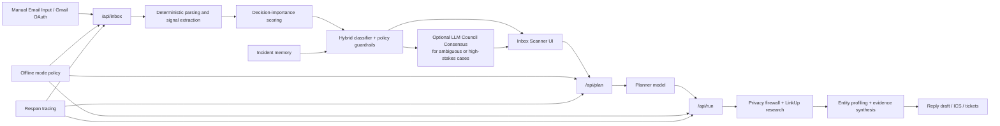

# Aegis Desk

> An AI workspace for uncertain email: verify who is behind a message, decide what to do next, and respond with confidence.


## Video Walkthrough

Video URL: https://www.loom.com/share/ba94b6a455b84ab5bcd2375a7d6b9025

## Problem Statement

Most inbox tools help you organize messages.
Aegis Desk is built around a different question:

**When an email looks important, but you are not fully sure you should trust it, how do you decide what to do next?**

That uncertainty shows up in real workflows:

- recruiter outreach that lands in spam
- contract follow-ups from unfamiliar senders
- vendor or payment emails with pressure to act quickly
- legal or operational messages that look relevant but could still be risky
- promotional noise mixed into genuinely important inbox traffic

This project started from a very practical moment: finding a potentially real job-related message in spam and realizing that the real problem was not just filtering email, but deciding whether a message deserved trust, urgency, verification, or dismissal.

The audience most affected is anyone whose inbox contains high-consequence ambiguity:

- job seekers
- freelancers and consultants
- founders and operators
- support or operations teams
- people who receive unfamiliar but potentially important outreach

If this problem is solved well, success looks like:

- important messages surface quickly without being drowned out by promo noise
- suspicious messages are treated as verification problems, not blindly obeyed
- users get a clear next action, not just a label
- email triage, reasoning, drafting, and escalation happen in one workflow

## Why This Matters

Email is still where some of the highest-stakes decisions happen, but current inbox products often collapse everything into a simple binary:

- spam vs not spam
- important vs not important
- safe vs unsafe

That misses the real-world middle ground.

Some emails are legitimate but uncertain.
Some emails are suspicious precisely because they look relevant.
Some promotional messages create fake urgency and steal attention from things that actually matter.

Aegis Desk is meant to be an **intelligence layer**, not just a sorting layer.
The goal is to help a user answer:

- Is this message real?
- How urgent is it really?
- What evidence supports that judgment?
- What should I do next?

## Solution Overview

Aegis Desk is a Next.js App Router application with four connected surfaces:

1. **Inbox Scanner**
   Scans manual or Gmail-sourced email, classifies messages, scores priority, estimates uncertainty, and proposes a trusted next action.
2. **Agent Desk**
   Turns a selected email into a structured analysis workflow: planning, research, entity profiling, evidence synthesis, reply drafting, and calendar artifact generation.
3. **Tickets / Admin Desk**
   Escalates high-stakes messages into a helpdesk-style workflow with local-first persistence and optional Peppermint sync.
4. **QueueGuard**
   A separate trust-and-step-up demo for queue/session risk workflows.

The core product idea is:

- deterministic safety controls handle policy, risk caps, and offline mode
- AI handles planning, synthesis, research interpretation, and structured drafting
- the user sees a decision-oriented workspace instead of disconnected tools

Key capabilities:

- Gmail OAuth connection and manual email scanning
- priority routing into `high`, `medium`, and `low`
- mail classification into `spam`, `harmful`, `actionable`, and `informational`
- deterministic decision-importance scoring for urgency, threat, relevance, opportunity, and noise
- optional **LLM Council Consensus** for ambiguous or high-stakes cases, with single-model mode as the default for cost control
- entity profiling and external research through LinkUp
- optional Respan tracing and prompt-managed synthesis
- reply draft and ICS generation
- local-first auth and ticketing with Mongo fallback support
- offline-enforced mode that blocks external AI and research calls

### What role does AI play?

AI is **core**, but intentionally bounded.

Without AI, the app could still score deterministic signals and enforce safety policy, but it would be much worse at:

- turning messy inbox context into a structured plan
- extracting and profiling entities
- synthesizing external evidence into an explanation
- drafting a useful reply
- adapting analysis output to the actual email context instead of a fixed template

The meaningful improvement over a non-AI approach is not "classification for classification's sake."
It is the combination of:

- evidence-backed reasoning
- context-sensitive drafting
- research-assisted profiling
- decision support at the moment of uncertainty

## AI Integration

### Models and APIs used

- **OpenAI via Vercel AI SDK**
  Primary model path for planning, entity profiling, and final synthesis. Current cost-conscious default is `gpt-4o-mini`.
- **Google Gemini and Anthropic Claude**
  Optional consensus models when multi-model mode is enabled.
- **LinkUp**
  External research provider for company/person/entity background checks.
- **Respan**
  Observability and optional prompt-management infrastructure for structured tracing and synthesis experiments.
- **Gmail API**
  OAuth-based inbox ingestion.

### Agentic patterns used

- structured planning in `/api/plan`
- multi-step execution in `/api/run`
- tool use for research, privacy filtering, and ICS generation
- structured JSON outputs validated with Zod
- entity extraction and profile caching
- fallback routing when AI paths fail
- optional council-style multi-model review, but single-model mode by default

### LLM Council Consensus

One of the product ideas I want to highlight is **LLM Council Consensus**.

Instead of trusting one model blindly for every ambiguous email, Aegis can run a council-style review where multiple models independently assess:

- the likely class of the message
- the safest next action
- confidence and disagreement
- whether a message should be escalated or treated as routine

In practical terms, that means:

- **default mode:** one model for speed and cost control
- **council mode:** multiple models such as GPT, Gemini, and Claude can be compared when enabled
- **important behavior:** disagreement is surfaced as part of the decision, not averaged away invisibly

That matters because many of the hardest inbox problems are not straightforward phishing emails. They are borderline cases where:

- a message looks relevant but lands in spam
- a sender seems real but is unfamiliar
- promotional language creates fake urgency
- the right answer is "verify before acting," not just "safe" or "unsafe"

The council pattern makes Aegis stronger than a simple single-pass classifier because it turns ambiguity into something inspectable and operationally useful.

### RAG, chaining, and reasoning

The system uses a practical hybrid of chaining and retrieval:

- **retrieval**
  LinkUp search and evidence collection
- **chaining**
  plan -> research -> profile -> synthesis -> reply/action
- **deterministic + AI hybrid**
  deterministic policy remains in control for risk caps, classification guardrails, and offline safety

### Why these choices?

- **cost**
  Single-model mode is the default to keep the product usable and affordable.
- **latency**
  Standard LinkUp depth is default; deep search is user-controlled.
- **reliability**
  Deterministic guardrails stay deterministic. AI does not replace safety policy.
- **accuracy**
  Structured schemas, research evidence, incident memory, and fallback logic reduce brittle outputs.

### Where AI exceeded expectations

- turning messy email + document context into structured workflows
- synthesizing evidence into readable, action-oriented output
- making dynamic research plans for detected entities
- adapting output sections to the context instead of forcing every email into a contract-only frame

### Where AI fell short

- legitimate high-stakes emails can still look scam-like
- promo language can create misleading urgency if not actively suppressed
- fallback conditions can still force extra human review even for low-value mail
- personalized inbox preferences need more learning depth than a one-shot LLM call can provide

That gap is exactly why the system now leans on deterministic decision logic, feedback memory, and explicit guardrails instead of handing classification entirely to the model.

## Architecture / Design Decisions

### High-level architecture



### Core design choices

#### 1. AI is additive, not sovereign

Risk logic, spam caps, harmful floors, offline enforcement, and trusted decision thresholds remain deterministic.
This keeps the system auditable and prevents model drift from silently changing security posture.

#### 2. Decision support beats raw classification

The system does not stop at "this looks risky."
It tries to answer:

- how urgent is this?
- how trustworthy is the sender?
- is this harmful, just noisy, or actually useful?
- what action should the user take?

#### 3. Single-model by default, LLM Council Consensus optional

Council-style consensus improves robustness for uncertain cases, but it increases cost and latency.
The repo keeps that path available while defaulting to one model for normal operation.

#### 4. Standard research by default, deep research by choice

Deep search is useful, but it should be a user decision for cost and latency reasons.

#### 5. Privacy-first and offline-capable

The app has explicit offline controls that can block:

- external model calls
- external research
- Gmail-connected scanning when outbound blocking is enabled

That matters because sensitive inbox workflows should not assume network trust.

#### 6. Local-first persistence with graceful fallback

Auth can use MongoDB or a local file DB.
Ticketing stays local-first, with optional Peppermint sync later.

### Third-party APIs / open-source systems used

- Next.js
- React
- TypeScript
- Zod
- Vercel AI SDK
- OpenAI API
- Anthropic API
- Google Generative AI API
- Gmail API
- LinkUp SDK
- Respan tracing SDK
- MongoDB / Mongoose
- Peppermint helpdesk integration
- `pdf-parse`

## How AI Coding Tools Changed the Build

AI coding tools were used as a force multiplier during development, especially for:

- route scaffolding
- schema iteration
- refactoring long AI pipeline handlers
- prompt tightening
- tracing and metadata wiring
- UI copy and workflow polishing

They helped move quickly through:

- repetitive TypeScript structure
- Zod schema generation
- API plumbing
- documentation and summarization of architectural changes

They were less helpful when:

- the product needed deterministic security logic
- classification errors came from subtle signal interactions
- prompts sounded plausible but violated strict JSON contracts
- repo-local constraints mattered more than generic best practices

That changed the development approach in an important way:

- AI coding tools accelerated generation
- deterministic review, smoke tests, and policy tuning still had to be done manually
- the final system improved most when AI was used for speed, not unchecked authority

## Getting Started / Setup Instructions

### Prerequisites

- Node.js 20+
- npm
- optional: MongoDB
- optional: Gmail OAuth credentials
- optional: LinkUp API key
- optional: Respan account / API key
- optional: Peppermint instance

### Clone and install

```bash
git clone https://github.com/Shreyp087/aegis-desk.git
cd aegis-desk
npm install
```

### Environment setup

Create a `.env.local` file in the project root.

Minimal local setup:

```bash
OPENAI_API_KEY=your_openai_key
AUTH_JWT_SECRET=replace_with_a_long_random_secret
```

Recommended setup for inbox + Gmail + research:

```bash
OPENAI_API_KEY=your_openai_key
LINKUP_API_KEY=your_linkup_key
AUTH_JWT_SECRET=replace_with_a_long_random_secret

GOOGLE_CLIENT_ID=your_google_oauth_client_id
GOOGLE_CLIENT_SECRET=your_google_oauth_client_secret
GOOGLE_REDIRECT_URI=http://localhost:3000/api/inbox/gmail/callback
```

Optional MongoDB:

```bash
MONGODB_URI=your_mongodb_connection_string
AUTH_DB_PROVIDER=mongo
```

Optional consensus models:

```bash
GOOGLE_GENERATIVE_AI_API_KEY=your_gemini_key
ANTHROPIC_API_KEY=your_claude_key
INBOX_CONSENSUS_ENABLED=false
INBOX_CONSENSUS_MAX_MODELS=3
```

Optional Respan:

```bash
RESPAN_ENABLED=false
RESPAN_API_KEY=your_respan_key
RESPAN_BASE_URL=https://api.respan.ai
RESPAN_ENVIRONMENT=development
RESPAN_GATEWAY_ENABLED=false
RESPAN_PROMPTS_ENABLED=false
RESPAN_PROMPT_ID_SYNTHESIS=your_prompt_id
```

Optional Peppermint sync:

```bash
PEPPERMINT_BASE_URL=http://localhost:5003
PEPPERMINT_AUTH_MODE=login
PEPPERMINT_EMAIL=admin@example.com
PEPPERMINT_PASSWORD=your_password
```

Notes:

- If `MONGODB_URI` is absent, auth falls back to local file storage.
- `.env.peppermint.example` can be used as a reference for ticket-sync variables.
- Do **not** commit live API keys or secrets.

### Run locally

```bash
npm run dev
```

Then open:

- `http://localhost:3000`

### Suggested local flow

1. Sign up or sign in.
2. Open the Inbox Scanner.
3. Paste sample input from [samples/sample_input.txt](samples/sample_input.txt) or connect Gmail.
4. Scan and review priority, class, explanation, and trusted action.
5. Escalate a message into Agent Desk.
6. Run planning and analysis.
7. Generate a draft reply, ICS artifact, or ticket.

## Demo

### Demo path 1: Manual inbox scan

1. Open `/inbox-scanner`.
2. Use the manual input mode.
3. Paste sample mail from [samples/sample_input.txt](samples/sample_input.txt).
4. Run scan.
5. Inspect:
   - priority
   - mail class
   - uncertainty
   - explanation
   - trusted action

### Demo path 2: Gmail-connected triage

1. Set Google OAuth credentials in `.env.local`.
2. Ensure the Gmail API is enabled in Google Cloud.
3. Add this redirect URI:
   - `http://localhost:3000/api/inbox/gmail/callback`
4. Connect Gmail from the scanner UI.
5. Run a Gmail scan.

### Demo path 3: End-to-end analysis

1. Select a scanned email.
2. Escalate it into Agent Desk.
3. Let `/api/plan` generate a multi-step workflow.
4. Let `/api/run` perform research and synthesis.
5. Review the structured output:
   - entity verdicts
   - analysis section
   - reply draft
   - meeting invite
   - claims and evidence

## Testing / Error Handling

### Validation and safeguards

- Zod schemas validate planner, runner, and synthesis outputs.
- Inbox scanning uses deterministic guardrails on top of model output.
- Offline mode can fully block outbound AI/research activity.
- Prompt-managed synthesis has a safe fallback to the inline synthesis path.
- Gmail integration fails gracefully when tokens are missing or invalid.
- Ticket sync remains local-first if Peppermint is unavailable.

### Failure modes considered

- legitimate emails being over-classified as scams
- promotional urgency inflating priority
- model failure or disagreement
- invalid JSON from AI calls
- missing Gmail credentials
- offline enforcement with outbound blocking
- absent MongoDB connection
- noisy or sparse email context

### Current validation used

- `npm run build`
- `npm run lint`
- targeted inbox smoke tests for:
  - recruiter deadline mail
  - Temu-style promotion mail
  - generic newsletter/promotional mail

Known state:

- the build passes
- lint still has unrelated pre-existing issues in a few files outside the inbox work

## Future Improvements / Stretch Goals

- stronger personalized learning from user feedback and sender-level affinity
- explicit low-risk auto-triage overrides when assist-model fallback happens
- benchmark dataset for recruiter, vendor, legal, and operational email types
- richer entity memory and sender reputation history
- more nuanced promotional value detection for user-followed brands or recurring interests
- evaluation dashboards for false positives / false negatives
- public demo deployment with seeded sample workflows

## Link to Website / Application

Public deployment: _Not currently published as a public production app_

Local development URL:

- `http://localhost:3000`

## Acknowledgments

This project uses third-party libraries and APIs including:

- Next.js / React / TypeScript
- Vercel AI SDK
- OpenAI
- Anthropic
- Google Generative AI
- Gmail API
- LinkUp
- Respan
- MongoDB / Mongoose
- Peppermint
- Zod

All credentials in setup examples above are placeholders only.
