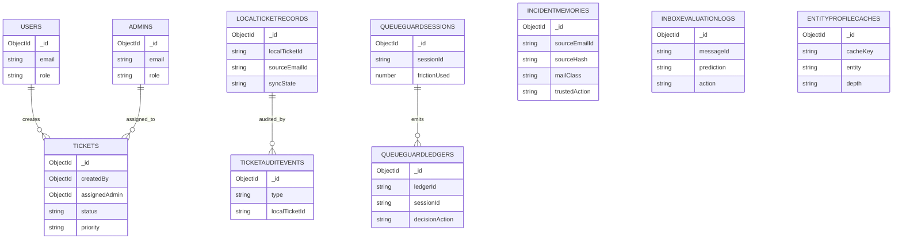

# Aegis Desk Database Architecture

## 1. Recommended Database

**Primary database:** MongoDB Atlas

**Why this database**
- Atlas has a free tier (`M0`) that is sufficient for development, demos, and early research collection.
- The codebase already uses **Mongoose** and Mongo-backed models for auth, tickets, inbox memory, sender reputation, and entity profile cache.
- Atlas scales cleanly from free shared clusters to dedicated production clusters without changing the application data model.
- The system stores a mix of structured records, nested evidence, audit traces, and cached model outputs, which fits MongoDB well.

**Recommended deployment path**
- Development / research: Atlas `M0`
- Team staging: Atlas `M10`
- Production / higher-throughput research runs: Atlas dedicated cluster with backups and VPC/network controls

## 2. Connection Strategy

Aegis Desk uses a single shared Mongoose connection defined in:
- `src/lib/db/mongoose.ts`

Required runtime variables:
- `MONGODB_URI`
- `MONGODB_DB` (optional, defaults to `aegis_desk`)

### Effective persistence model
- **Mongo-first** when `MONGODB_URI` is configured
- **Compatibility fallback** remains in a few legacy helpers where local/file behavior already existed, but the intended scalable path is MongoDB Atlas

## 3. Collection Inventory

| Collection | Purpose | Primary Keys / Unique Fields | Main Code Path |
| --- | --- | --- | --- |
| `users` | End-user accounts | `email` unique | `src/lib/models/User.ts` |
| `admins` | Admin/operator accounts | `email` unique | `src/lib/models/Admin.ts` |
| `tickets` | Native authenticated ticket workflow | Mongo `_id` | `src/lib/models/Ticket.ts` |
| `incidentmemories` | Inbox scanner historical memory and feedback | Mongo `_id` | `src/lib/models/IncidentMemory.ts` |
| `senderreputationsnapshots` | Domain/sender reputation snapshots | sender/domain oriented indexes | `src/lib/models/SenderReputationSnapshot.ts` |
| `entityprofilecaches` | Cached external research/entity profiles | `cacheKey` unique | `src/lib/models/EntityProfileCache.ts` |
| `inboxevaluationlogs` | Per-message research/evaluation log records | Mongo `_id` | `src/lib/models/InboxEvaluationLog.ts` |
| `queueguardsessions` | Persistent QueueGuard session state | `sessionId` unique | `src/lib/models/QueueGuardSession.ts` |
| `queueguardledgers` | Persistent QueueGuard trust/audit ledger | `ledgerId` unique, `entryHash` indexed | `src/lib/models/QueueGuardLedger.ts` |
| `localticketrecords` | Legacy-compatible local/sync ticket records | `localTicketId` unique, `sourceEmailId` unique | `src/lib/models/LocalTicketRecord.ts` |
| `ticketauditevents` | Ticket sync/admin audit trail | Mongo `_id` | `src/lib/models/TicketAuditEvent.ts` |

## 4. Logical Relations

MongoDB collections are document-oriented, but Aegis Desk still has clear logical relations.

| Source | Relation | Target | Notes |
| --- | --- | --- | --- |
| `users` | 1-to-many | `tickets` | `tickets.createdBy -> users._id` |
| `admins` | 1-to-many | `tickets` | `tickets.assignedAdmin -> admins._id` |
| `incidentmemories` | many-to-1 logical | inbox emails | keyed by `sourceEmailId`, `sourceHash`, sender/domain fingerprints |
| `entityprofilecaches` | many-to-1 logical | researched entities | keyed by `cacheKey`, logically attached to plan/run analysis |
| `inboxevaluationlogs` | many-to-1 logical | inbox emails | keyed by `messageId` |
| `localticketrecords` | 1-to-1 logical | inbox emails | `sourceEmailId` unique |
| `ticketauditevents` | many-to-1 | `localticketrecords` | `localTicketId` groups event stream |
| `queueguardledgers` | many-to-1 | `queueguardsessions` | `sessionId` groups decision history |

## 5. Collection Schemas

### 5.1 Identity and Access

#### `users`
| Field | Type | Notes |
| --- | --- | --- |
| `_id` | ObjectId | Primary key |
| `name` | string | User display name |
| `email` | string | Unique login identifier |
| `passwordHash` | string | Stored credential hash |
| `role` | string | Fixed to `user` |
| `lastLogin` | date/null | Last successful auth |
| `createdAt` | date | Mongoose timestamp |

#### `admins`
| Field | Type | Notes |
| --- | --- | --- |
| `_id` | ObjectId | Primary key |
| `name` | string | Admin display name |
| `email` | string | Unique login identifier |
| `passwordHash` | string | Stored credential hash |
| `role` | string | Fixed to `admin` |
| `lastLogin` | date/null | Last successful auth |
| `createdAt` | date | Mongoose timestamp |

### 5.2 Ticketing

#### `tickets`
| Field | Type | Notes |
| --- | --- | --- |
| `_id` | ObjectId | Primary key |
| `title` | string | Ticket title |
| `description` | string | Ticket body |
| `status` | enum | `open`, `in_progress`, `resolved` |
| `priority` | enum | `low`, `medium`, `high` |
| `createdBy` | ObjectId | Ref `users._id` |
| `assignedAdmin` | ObjectId/null | Ref `admins._id` |
| `adminResponse` | string | Operator response |
| `resolvedAt` | date/null | Resolution timestamp |
| `createdAt` | date | Timestamp |
| `updatedAt` | date | Timestamp |

#### `localticketrecords` (legacy compatibility / sync record)
| Field | Type | Notes |
| --- | --- | --- |
| `localTicketId` | string | Unique compatibility identifier |
| `sourceEmailId` | string | Unique inbox linkage |
| `peppermintTicketId` | string/null | External sync id |
| `channel` | enum | `inbox` or `user_dashboard` |
| `sender` | string | Original sender |
| `requesterName` | string | Optional requester name |
| `subject` | string | Escalated subject |
| `details` | string | Local/legacy ticket body |
| `date` | string | Source date |
| `risk` | object | Category, score, deterministic notes, optional LLM summary |
| `decision` | enum | `escalate`, `quarantine` |
| `confidence` | number | 0..1 |
| `syncState` | enum | `local_only`, `pending`, `synced`, `failed` |
| `lastSyncAttemptAt` | date/null | Last external sync attempt |
| `lastSyncError` | string | Last sync error |
| `admin` | object | Admin status, assignee, notes, updatedAt |
| `createdAt` | date | Timestamp |
| `updatedAt` | date | Timestamp |

#### `ticketauditevents`
| Field | Type | Notes |
| --- | --- | --- |
| `_id` | ObjectId | Primary key |
| `type` | string | Event name |
| `at` | date | Event time |
| `localTicketId` | string | Logical parent ticket |
| `sourceEmailId` | string | Optional source email id |
| `decision` | string | Optional ticket decision |
| `confidence` | number | Optional decision confidence |
| `syncState` | string | Optional sync state |
| `status` | string | Optional admin status |
| `assignee` | string | Optional assignee snapshot |
| `notePreview` | string | Optional admin note excerpt |
| `peppermintBaseUrl` | string | Optional outbound sync target |
| `peppermintEndpoint` | string | Optional endpoint |
| `payload` | mixed | Optional sync payload snapshot |
| `peppermintTicketId` | string | Optional remote ticket id |
| `error` | string | Optional sync failure detail |
| `createdAt` | date | Timestamp |

### 5.3 Inbox Intelligence

#### `incidentmemories`
| Field | Type | Notes |
| --- | --- | --- |
| `_id` | ObjectId | Primary key |
| `sourceEmailId` | string | Email identifier |
| `sourceHash` | string | Stable hash for feedback matching |
| `senderDomain` | string | Domain snapshot |
| `senderEmailHash` | string | Hashed sender email |
| `subjectHash` | string | Hashed subject |
| `primaryCategory` | string | Top scanner category |
| `mailClass` | string | `spam`, `harmful`, `actionable`, `informational` |
| `threatType` | string | Scanner threat family |
| `trustedAction` | string | Scanner action |
| `priorityScore` | number | 0..100 |
| `consensusScore` | number | 0..100 |
| `riskTags` | string[] | Tag list |
| `signals` | string[] | Legacy flat signals |
| `uncertaintyScore` | number | 0..1 |
| `uncertaintyTypes` | string[] | Structured uncertainty categories |
| `uncertaintySources` | object | Model confidence, conflict, missing fields |
| `deterministicSignals` | object | Structured rule-driven signals |
| `learnedSignals` | object | Structured classifier/consensus outputs |
| `explanationSummary` | string | Scanner explanation |
| `explanationKeyFactors` | string[] | Top explanatory factors |
| `evidenceRefs` | object[] | Weighted evidence references |
| `policyVersion` | string | Scanner policy version |
| `modelVersion` | string | Scanner model version |
| `outcomeLabel` | string | Feedback label |
| `feedbackSource` | string | Feedback origin |
| `createdAt` | date | Timestamp |
| `updatedAt` | date | Timestamp |

#### `inboxevaluationlogs`
| Field | Type | Notes |
| --- | --- | --- |
| `_id` | ObjectId | Primary key |
| `loggedAt` | date | Log timestamp |
| `messageId` | string | Message identifier |
| `prediction` | string | Final predicted label |
| `rawPrediction` | string | Raw classifier label |
| `confidence` | number | 0..100 final confidence |
| `rawModelConfidence` | number | 0..1 classifier posterior |
| `uncertainty` | number | 0..1 normalized uncertainty |
| `uncertaintyPercent` | number | 0..100 display uncertainty |
| `action` | string | Final scanner action |
| `routingAction` | string | Decision-layer routing |
| `consensusMode` | enum | `single` or `multi` |
| `consensusSource` | enum | env/admin origin |
| `consensusMaxModels` | number | Configured cap |
| `consensusModels` | string[] | Participating providers/models |
| `consensusStrength` | number | 0..1 agreement strength |
| `disagreementFlags` | string[] | Disagreement metadata |
| `sourceMode` | enum | `manual` or `gmail` |
| `processingMode` | enum | offline/hybrid mode |
| `modelVersion` | string | Scanner model version |
| `classifierVersion` | string | Classifier version |
| `policyVersion` | string | Policy version |
| `groundTruth` | object | Reserved annotation hook |
| `createdAt` | date | Timestamp |
| `updatedAt` | date | Timestamp |

#### `senderreputationsnapshots`
| Field | Type | Notes |
| --- | --- | --- |
| `_id` | ObjectId | Primary key |
| `senderDomain` | string | Domain key |
| `reputationScore` | number | Score snapshot |
| `findings` | string[] | Reputation evidence |
| `createdAt` | date | Timestamp |
| `updatedAt` | date | Timestamp |

### 5.4 Research and Agent Memory

#### `entityprofilecaches`
| Field | Type | Notes |
| --- | --- | --- |
| `_id` | ObjectId | Primary key |
| `cacheKey` | string | Unique cache identifier |
| `entity` | string | Entity label |
| `entityType` | string | Entity type |
| `query` | string | Research query |
| `depth` | enum | `standard`, `deep` |
| `profile` | mixed | Cached profile object |
| `confidence` | number | Confidence snapshot |
| `sourceUrls` | string[] | Source URLs |
| `expiresAt` | date | TTL boundary |
| `lastAccessedAt` | date | Cache touch time |
| `createdAt` | date | Timestamp |
| `updatedAt` | date | Timestamp |

### 5.5 QueueGuard

#### `queueguardsessions`
| Field | Type | Notes |
| --- | --- | --- |
| `_id` | ObjectId | Primary key |
| `sessionId` | string | Unique QueueGuard session id |
| `createdAtMs` | number | Session start timestamp (epoch ms) |
| `lastSeenAtMs` | number | Last activity timestamp |
| `trustedUntilMs` | number | Trust window expiry |
| `frictionUsed` | number | Consumed friction budget |
| `challengeAttempts` | number | Total challenge attempts |
| `challengePasses` | number | Successful verifications |
| `challengeFailures` | number | Failed verifications |
| `pendingChallenge` | object | Active challenge state |
| `lastDecision` | object | Last QueueGuard decision |
| `lastEventType` | enum | Last event processed |
| `history` | object[] | Compact recent event history |
| `payloadCounts` | map | Replay tracking |
| `sequenceCounts` | map | Sequence tracking |
| `createdAt` | date | Timestamp |
| `updatedAt` | date | Timestamp |

#### `queueguardledgers`
| Field | Type | Notes |
| --- | --- | --- |
| `_id` | ObjectId | Primary key |
| `ledgerId` | string | Unique ledger id |
| `ts` | string | ISO event time |
| `sessionId` | string | Parent session id |
| `eventKind` | enum | `score`, `verify` |
| `eventType` | enum | `join_queue`, `checkout`, `refresh` |
| `attemptedAction` | enum | Attempted event |
| `decisionAction` | enum | `ALLOW`, `STEP_UP`, `THROTTLE`, `BLOCK` |
| `risk` | number | 0..100 |
| `topFactorKeys` | string[] | Top contributing factors |
| `stepUpLevel` | number | 0, 1, or 2 |
| `stepUpOutcome` | enum | `none`, `issued`, `pass`, `fail` |
| `policyVersion` | string | Policy version |
| `frictionBudget` | object | Budget snapshot |
| `latencyMs` | number | Endpoint latency |
| `prevHash` | string | Previous ledger hash |
| `entryHash` | string | Current hash |
| `createdAt` | date | Timestamp |
| `updatedAt` | date | Timestamp |

## 6. Entity-Relationship Diagram



## 7. Persistence Flow Diagram

```mermaid
flowchart LR
    A[Inbox Scanner / Gmail / Manual Input] --> B[/api/inbox]
    B --> C[IncidentMemory]
    B --> D[InboxEvaluationLog]

    E[Agent Planner] --> F[/api/plan]
    G[Agent Runner] --> H[/api/run]
    H --> I[EntityProfileCache]

    J[User Ticket Actions] --> K[/api/tickets/*]
    K --> L[Tickets]

    M[Legacy Ticket Sync Helpers] --> N[LocalTicketRecord]
    M --> O[TicketAuditEvent]

    P[QueueGuard Score / Verify] --> Q[/api/queueguard/*]
    Q --> R[QueueGuardSession]
    Q --> S[QueueGuardLedger]
```

## 8. Indexing and Performance Notes

### Recommended hot-path indexes
- `tickets.createdBy + createdAt`
- `tickets.assignedAdmin + status + createdAt`
- `incidentmemories.sourceHash + createdAt`
- `incidentmemories.senderDomain + createdAt`
- `entityprofilecaches.cacheKey` unique
- `entityprofilecaches.expiresAt` TTL
- `inboxevaluationlogs.messageId + loggedAt`
- `queueguardsessions.sessionId` unique
- `queueguardledgers.sessionId + ts`
- `queueguardledgers.decisionAction + ts`

### Scaling notes
- Atlas `M0` is fine for auth, scanner memory, evaluation logging, and moderate QueueGuard/test traffic.
- For production traffic, move QueueGuard and evaluation-heavy workloads to an `M10+` cluster because ledger/event volume grows quickly.
- If inbox evaluation logging volume becomes large, archive old records to object storage or analytical warehousing while keeping recent windows in Atlas.

## 9. Migration Notes

### Already Mongo-native
- Auth accounts (`users`, `admins`)
- Native ticket workflow (`tickets`)
- Inbox incident memory (`incidentmemories`)
- Sender reputation (`senderreputationsnapshots`)
- Agent entity cache (`entityprofilecaches`)

### Migrated in this pass
- Inbox evaluation logging -> `inboxevaluationlogs`
- QueueGuard session state -> `queueguardsessions`
- QueueGuard ledger -> `queueguardledgers`
- Legacy ticket local-store compatibility -> `localticketrecords`
- Ticket audit trail -> `ticketauditevents`

### Compatibility behavior
- Legacy helpers still keep their function signatures so existing callers do not need to change.
- Where a local/file fallback existed previously, it can still act as a compatibility fallback if Mongo is not configured.
- The intended production path is **MongoDB Atlas only**.

## 10. Operational Checklist

1. Provision a MongoDB Atlas cluster.
2. Create an application database user with least privilege.
3. Add `MONGODB_URI` to the deployment environment.
4. Optionally set `MONGODB_DB` to isolate environments (`aegis_dev`, `aegis_staging`, `aegis_prod`).
5. Deploy the app and allow Mongoose to create indexes.
6. Verify writes through these endpoints:
   - `/api/inbox`
   - `/api/run`
   - `/api/tickets/create`
   - `/api/queueguard/score`
   - `/api/queueguard/stepup/verify`
7. Confirm collections are populated in Atlas.
8. Add backups / alerting before production workloads.

## 11. Source Files

Core connection and models:
- `src/lib/db/mongoose.ts`
- `src/lib/models/User.ts`
- `src/lib/models/Admin.ts`
- `src/lib/models/Ticket.ts`
- `src/lib/models/IncidentMemory.ts`
- `src/lib/models/SenderReputationSnapshot.ts`
- `src/lib/models/EntityProfileCache.ts`
- `src/lib/models/InboxEvaluationLog.ts`
- `src/lib/models/QueueGuardSession.ts`
- `src/lib/models/QueueGuardLedger.ts`
- `src/lib/models/LocalTicketRecord.ts`
- `src/lib/models/TicketAuditEvent.ts`

Runtime persistence adapters:
- `src/lib/inbox/evaluation.ts`
- `src/lib/queueguard/store.ts`
- `src/lib/tickets/store.ts`
- `src/lib/tickets/audit.ts`
